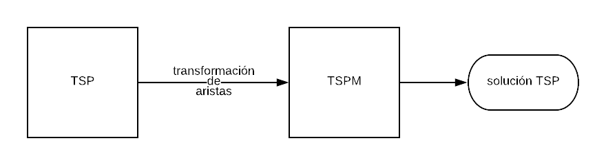
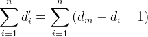
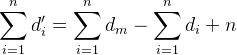
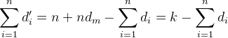

## Ejercicio 2

El problema propuesto es el del viajante (TSP) en su versión de optimización, pero se busca el camino máximo en lugar del mínimo.

Se sabe que TSP es NP-hard y, de esta forma, se puede intuir que el problema del máximo debe serlo también. Para demostrar esto, basta ver que TSP puede reducirse en tiempo polinómico a este otro problema y, además, éste no pertenece a NP.

### TSP

Dado un grafo completo, pesado y no dirigido G(V, E) cuyos pesos son positivos, se busca el ciclo Hamiltoniano en el cual la suma de los pesos de las aristas sea mínima.

### Hardness

Se utilizará un reducción de TSP a TSP Máximo (TSPM) para comprobar la dificultad de TSPM. Esto se realizará mediante una transformación que nos asegure que, cuanto más pesada es una arista, menos pesada sea su transformada.

Para obtener el menor ciclo Hamiltoniano utilizando TSPM, se puede utilizar la siguiente reducción de TSP:

 1. Se busca la arista con mayor peso, la cuál llamaremos dm.
 2. Se multiplican los pesos de todas las aristas por -1 y se les suma dm + 1.
 3. Se busca el ciclo Hamiltoniano máximo en el nuevo grafo (TSPM).
 4. El camino corresponde al mínimo en el grafo original.

    

### Demostración

Se quiere comprobar que la solución de la reducción es válida. Es decir, obtener el ciclo máximo en el grafo transformado equivale a obtener el mínimo en el grafo original.

Sea di > 0 el peso de la i-ésima arista en el grafo original y d'i=dm - di + 1 el peso de la misma arista en la solución de TSPM, el recorrido total es:

Se puede ver que el máximo se alcanza cuando la sumatoria de di es mínima, ya que *k* es un número siempre positivo.

Como al grafo original solamente se le modificaron los pesos, entonces si la solución de TSPM es un camino Hamiltoniano también debe serlo la misma secuencia en el grafo original.

Por lo tanto, se comprueba que la secuencia de aristas di es un camino Hamiltoniano mínimo.

### Certificación

Dada una secuencia de aristas que componen el máximo ciclo Hamiltoniano en un grafo, se puede observar que para verificar que esto es cierto, es necesario evaluar todos los ciclos posibles, lo cual equivale a resolver el problema. Como se demuestró anteriormente, TSPM es NP-hard, y por lo tanto no puede pertenecer a NP.

### Complejidad

El paso 1 requiere recorrer todas las aristas del grafo, por lo que resulta O(|V| + |E|) si se tiene una representación con listas.

El paso 2 también implica recorrer todas las aristas, por lo que resulta O(|V| + |E|).

El paso 3 corresponde a la reducción.

El paso 4 no requiere ningún cambio, ya que la correspondencia entre aristas y nodos en la transformación es 1 a 1. Es decir que la lista de aristas que conforman una solución de TSPM conforman la solución de TSP.

Como puede observarse, la reducción se llevó a cabo en tiempo polinómico. Al poder resolver TSP utilizando TSPM, se puede afirmar que TSP ≤p TSPM y, como TSP es NP-hard, TSPM también lo es.
